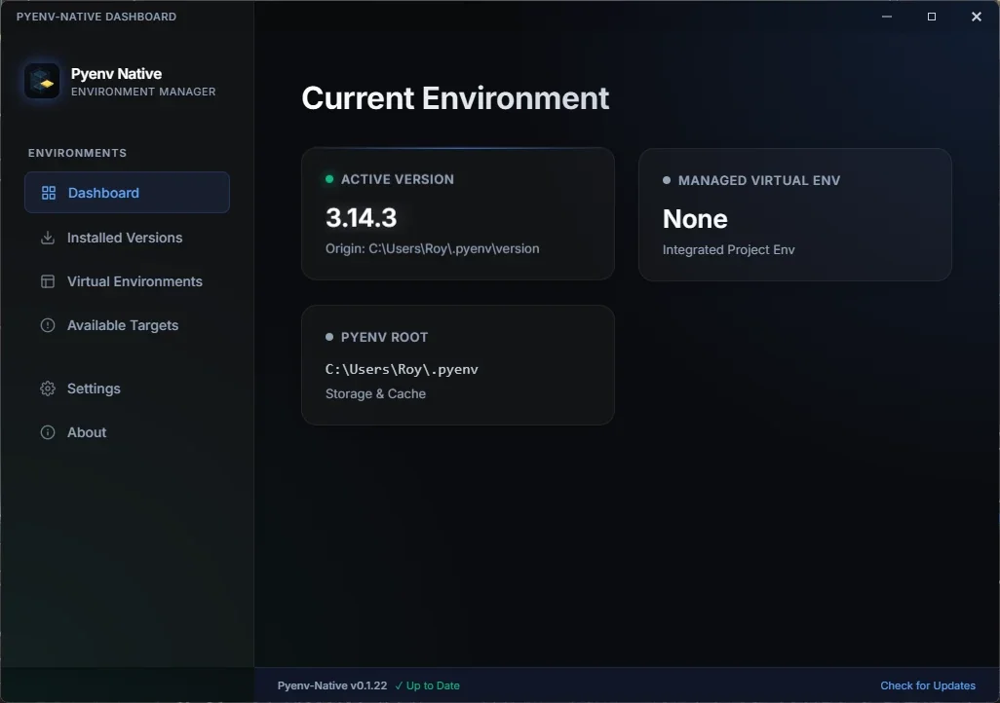

#  pyenv-native


**A native-first, cross-platform Python version manager inspired by `pyenv`. Built for speed and reliability on Windows, Linux, and macOS.**

`pyenv-native` is a native Rust reimplementation of the `pyenv` experience. It provides familiar workflows for version selection while removing shell and platform limitations, especially on Windows.

---

## Current Status: Actively Maturing

`pyenv-native` is currently in active development. While it is used daily by its creators, it should be considered "production-intended" but still subject to community validation.

- **Windows**: Stable (Primary platform)
- **Linux/macOS**: Tested
- **Android/Termux**: **Experimental** (Requires manual setup)

---

## The Ecosystem

`pyenv-native` is more than a CLI; it is a native foundation for Python development.

### 💻 [The CLI (Core Product)](./docs/CLI.md)

The high-performance core. Manages Python installations, shims, and shell integration.

- **Native-First**: No Bash dependency.
- **Opinionated Power**: Built-in managed `venv` support (replaces `pyenv-virtualenv`).
- **Validated Performance**: Reliable version selection on Windows, Linux, and macOS.

### 🖼️ [The GUI Companion (Preview)](./docs/GUI.md)

A premium desktop dashboard built with Tauri v2.

- **Dashboard**: Live view of your managed environments.
- **Visual Control**: Install versions and manage venvs with one click.
- **Status**: Stable on Windows; Experimental/Build-from-source on Linux/macOS.

### 🤖 [Agentic / MCP Support](./docs/MCP.md)

A structured bridge for AI models like Claude or Gemini.

- **Standardized**: Built-in MCP server support.
- **Model-Friendly**: Allows AI agents to inspect, configure, and manage Python environments safely.

---

## Quick Install

To ensure stability, the following commands fetch the installer from the **latest fixed release tag**.

### Windows (PowerShell)

```powershell
$installer = Join-Path $env:TEMP 'pyenv-native-install.ps1'; Invoke-WebRequest https://github.com/imyourboyroy/pyenv-native/releases/latest/download/install.ps1 -OutFile $installer; & $installer
```

### Linux / macOS (Bash/Zsh)

```bash
curl -fsSL https://github.com/imyourboyroy/pyenv-native/releases/latest/download/install.sh | sh
```

---

## Quick Uninstall

If you need to remove `pyenv-native`, you can use the web uninstaller or the native CLI command.

### Web Uninstaller (Self-Contained)

**Windows (PowerShell):**

```powershell
$uninstaller = Join-Path $env:TEMP 'pyenv-native-uninstall.ps1'; Invoke-WebRequest https://github.com/imyourboyroy/pyenv-native/releases/latest/download/uninstall.ps1 -OutFile $uninstaller; & $uninstaller -RemoveRoot
```

**Linux / macOS (Bash/Zsh):**

```bash
curl -fsSL https://github.com/imyourboyroy/pyenv-native/releases/latest/download/uninstall.sh | sh -s -- --remove-root
```

### Native CLI Uninstall

If `pyenv` is already in your PATH, you can run:

```bash
pyenv self-uninstall
```

### Python Bootstrap (`pip` / `pipx`)
>
> [!NOTE]
> The PyPI package is a **bootstrap installer only**. It is used to download and manage the native `pyenv-native` runtime; it is not the implementation of the tool itself.

```bash
pipx install pyenv-native
pyenv-native install --install-root ~/.pyenv
```

---

## Documentation Registry

Detailed technical guides and instructions:

- 📖 **[CLI Usage Guide](./docs/CLI.md)** — Core commands, `venv` management, and shell setup.
- 🎨 **[GUI Dashboard Guide](./docs/GUI.md)** — Features, screenshots, and visual management.
- 🔗 **[MCP / Agent Guide](./docs/MCP.md)** — Integration for AI models and IDEs.
- 🏗️ **[Architecture](./docs/ARCHITECTURE.md)** — Native shims, version resolution, and design philosophy.
- 🗑️ **[Uninstallation Guide](./docs/INSTRUCTIONS.md#uninstallation)** — Safely removing `pyenv-native`.

---

## Visual Previews

### CLI Environment

```bash
$ pyenv versions
  system
* 3.13.1 (set by C:\Users\Roy\.pyenv\version)
  3.12.8
  3.12.8/envs/api  (managed venv)
```

### Categorized Help Reference

```text
SELECTION:      global, local, shell, latest, version, version-name, prefix
PROVISIONING:   install, available, versions, uninstall
ENVIRONMENT:    venv (managed virtual environments)
INTERFACE:      init, gui, rehash, shims, prompt, exec, completions
DIAGNOSTICS:    doctor, status, config, root, which, whence
MAINTENANCE:    self-update, self-uninstall
```

### GUI Dashboard



---

## Relationship to pyenv

`pyenv-native` is an independent reimplementation inspired by the `pyenv` experience. It is not affiliated with or endorsed by the official `pyenv` project. We thank the `pyenv` maintainers for shaping the standard for Python version management.

---

Created by: **Roy Dawson IV** | [GitHub](https://github.com/imyourboyroy) | [PyPI](https://pypi.org/user/ImYourBoyRoy/) | License: **MIT**
