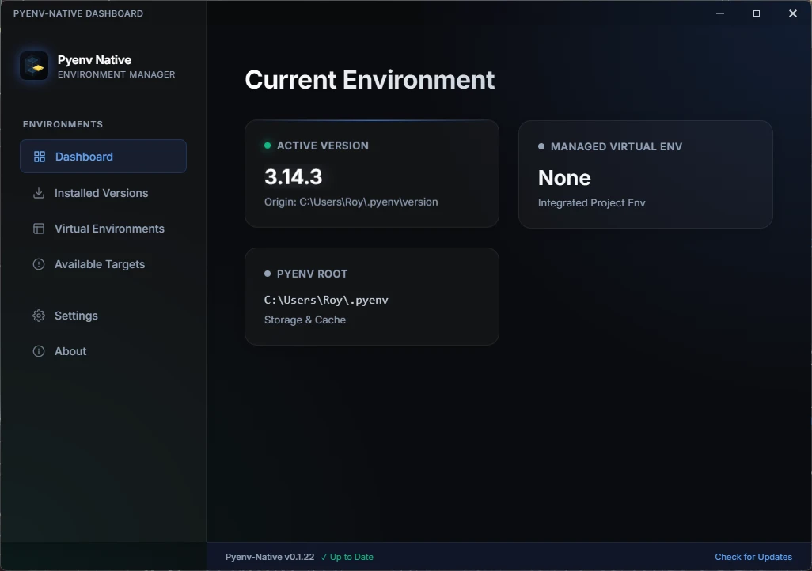
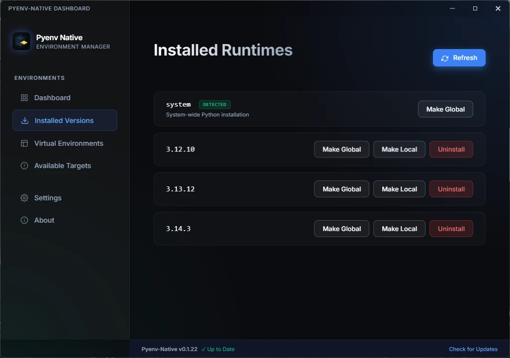
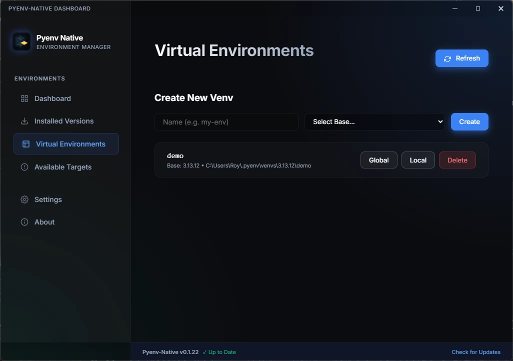
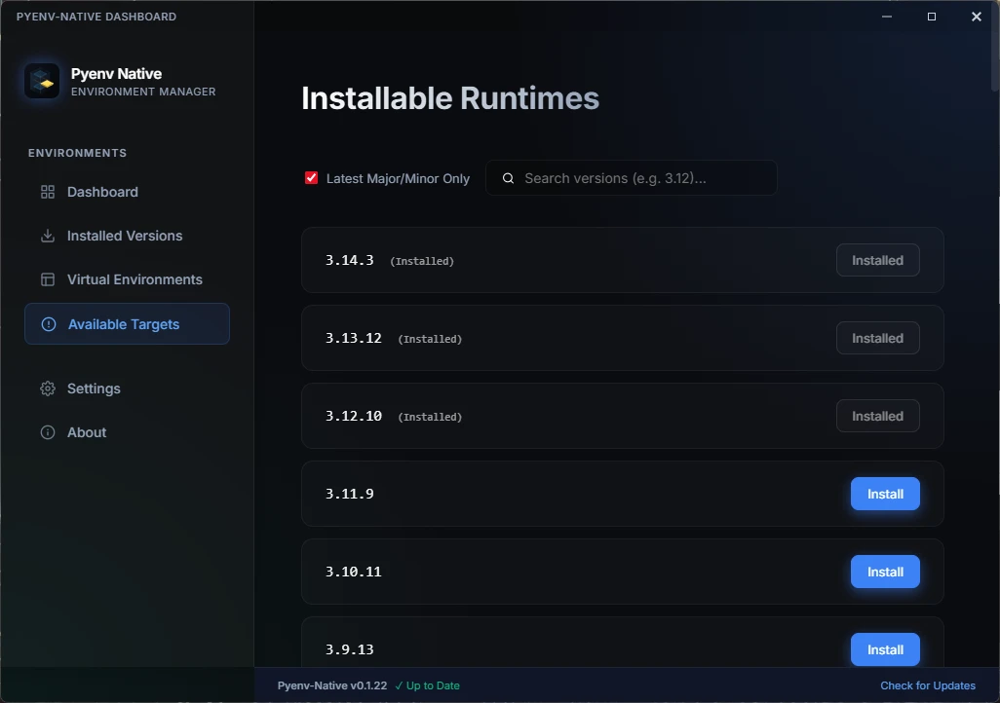
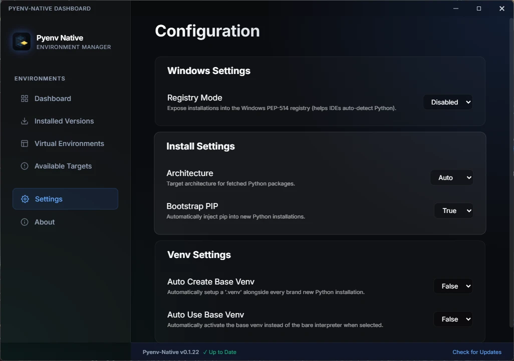
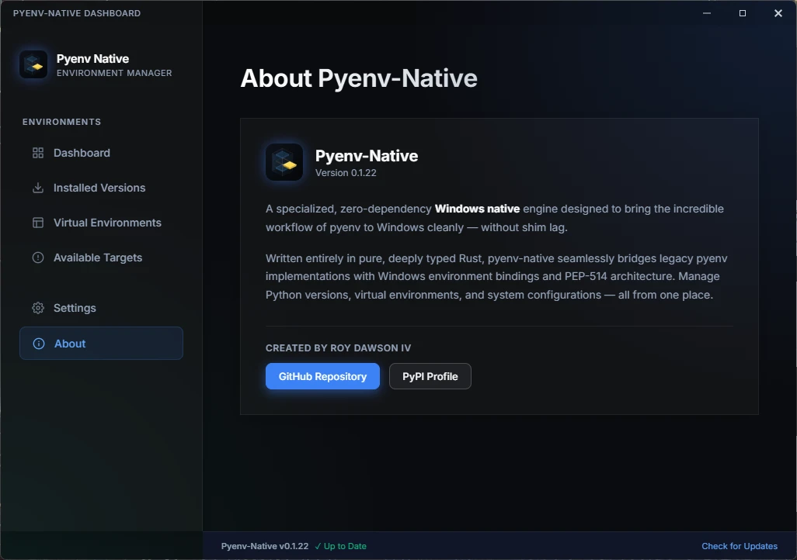

# Pyenv Native GUI Companion

The **Pyenv Native GUI** is a premium desktop dashboard built with Tauri v2, providing a visual interface for managing your Python environments.

> [!IMPORTANT]
> **Status: Experimental / Preview**
> The GUI is currently most stable on **Windows**. While macOS and Linux builds are possible from source, they are not yet fully validated or provided as pre-compiled bundles.

## Features

- **Dashboard**: Live view of your active Python version, managed venvs, and pyenv root, including a glowing status light indicator for pending active pip updates.
- **Pip Package Explorer**: Frosted-glass sliding drawer focused on a target interpreter to browse installed dependencies, audit updates, and statically pre-check requirements.txt constraints.
- **Cozy Pip Updates**: Audits packages against PyPI and provides a checklist for multiselect updates. Outdated pip installations get an isolated cozy update card first before modifying libraries.
- **Conflict Pre-checker**: Statically resolves local files or pasted remote URLs (auto-translating GitHub repositories) to run conflict analysis comparisons against installed packages, raising coral mismatch indicators and hover tooltips *before* triggering pip.
- **Visual Management**: Browse and install from the full CPython/PyPy catalog with a single click.
- **Venv Manager**: Create, list, and delete named virtual environments graphically.
- **Settings**: Configure registry integration, architecture preferences, and pip bootstrapping.
- **Self-Update**: Check for and install `pyenv-native` updates directly from the UI.

## Visual Tour


<details>
<summary><b>View Screen Gallery</b></summary>
<br />

| Dashboard | Installed Versions | Virtual Envs |
| :---: | :---: | :---: |
|  |  |  |

| Available Targets | Settings | About |
| :---: | :---: | :---: |
|  |  |  |

</details>

## Installation & Launch

### Windows

The GUI is included in the default Windows release bundle. If `pyenv` is on your path, you can launch it via:

```powershell
# Coming in a future update: pyenv gui launch
# For now, use the dev script or the Start Menu shortcut
.\scripts\launch_gui.ps1
```

### Building from Source (macOS/Linux)

You can build the GUI from source if you have the Rust toolchain installed:

```bash
cargo build --release -p pyenv-gui
```

*Note: Linux users will need `webkit2gtk-4.1` and other Tauri system dependencies installed.*

---

The GUI is designed as a companion to the core CLI. All changes made in the GUI are instantly reflected in your terminal and vice versa.
