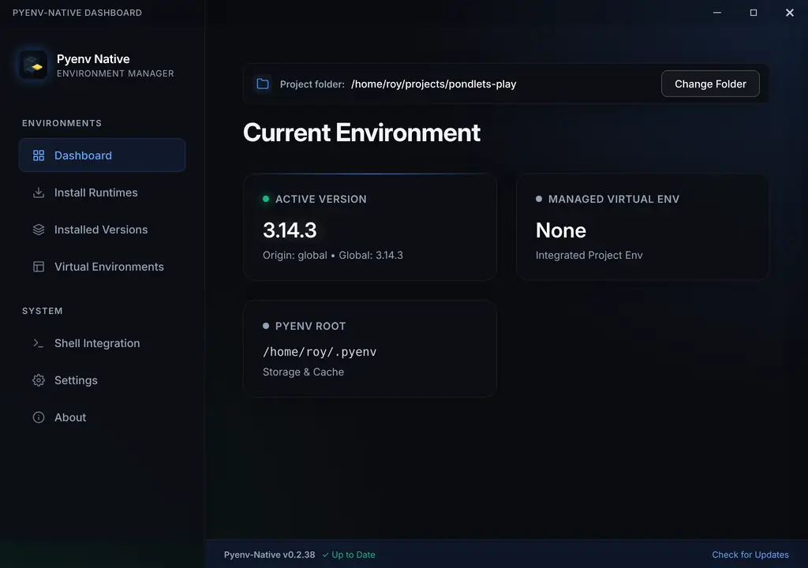
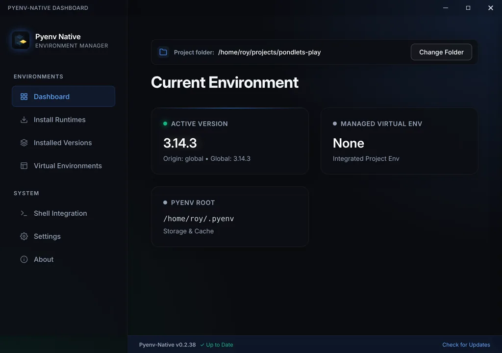
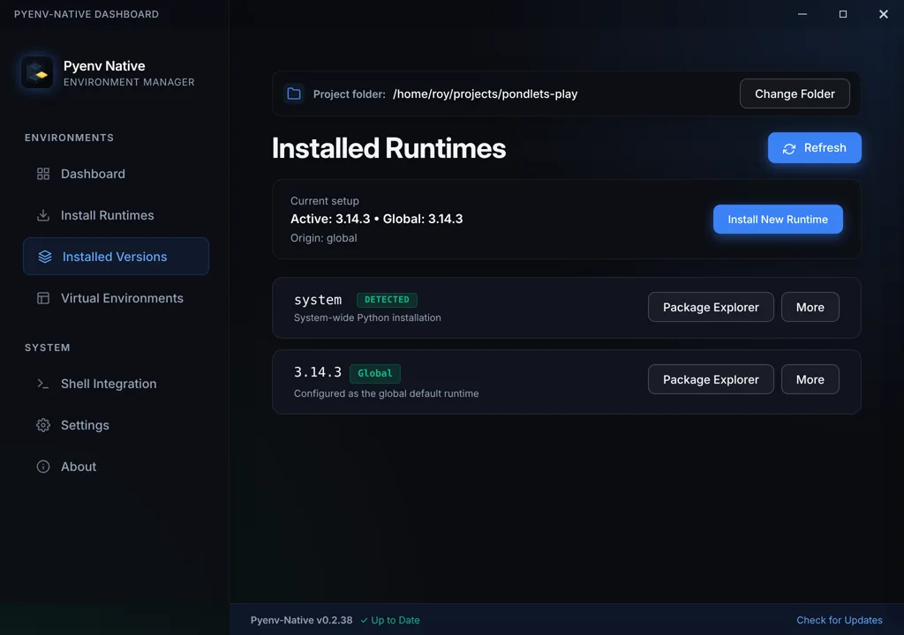
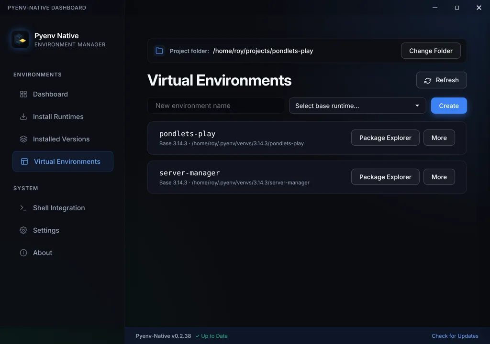
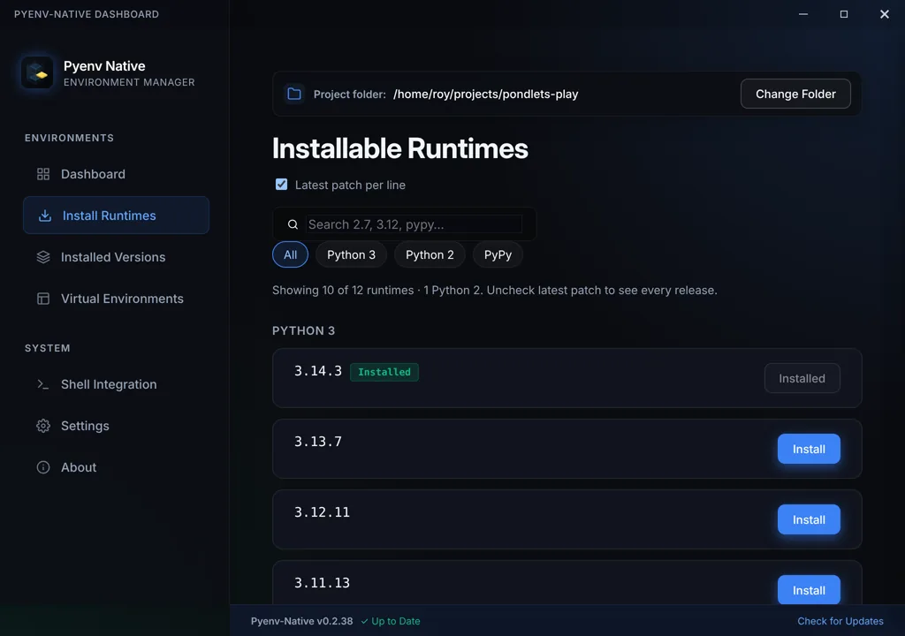
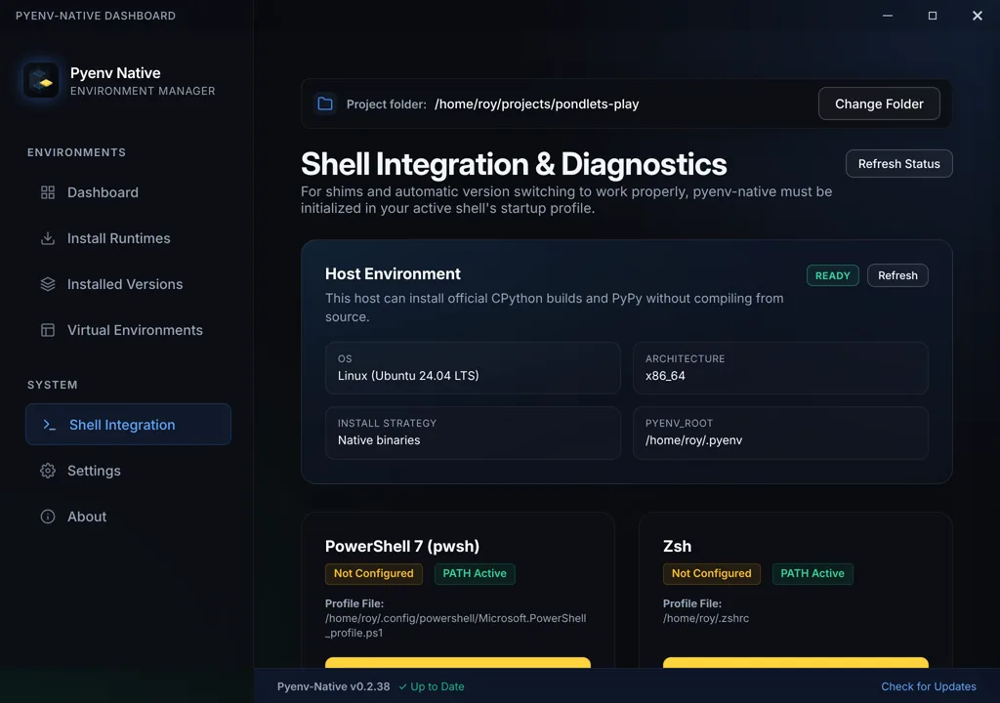
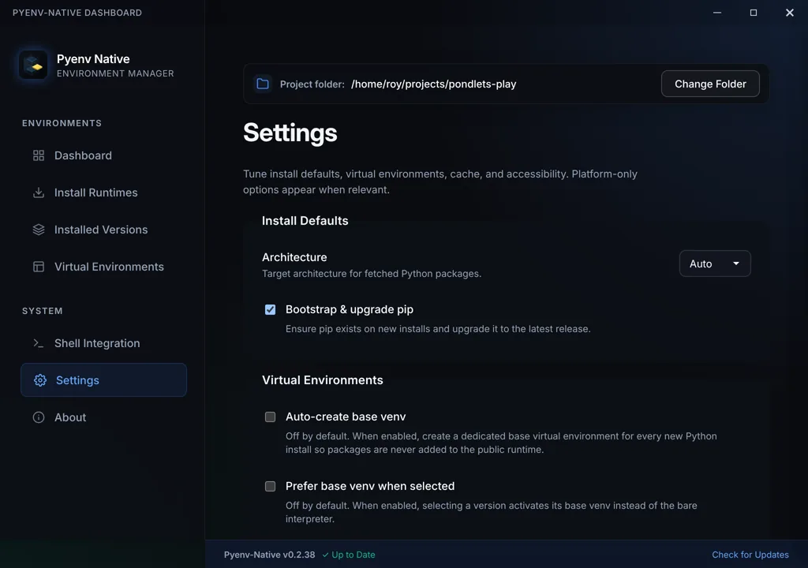
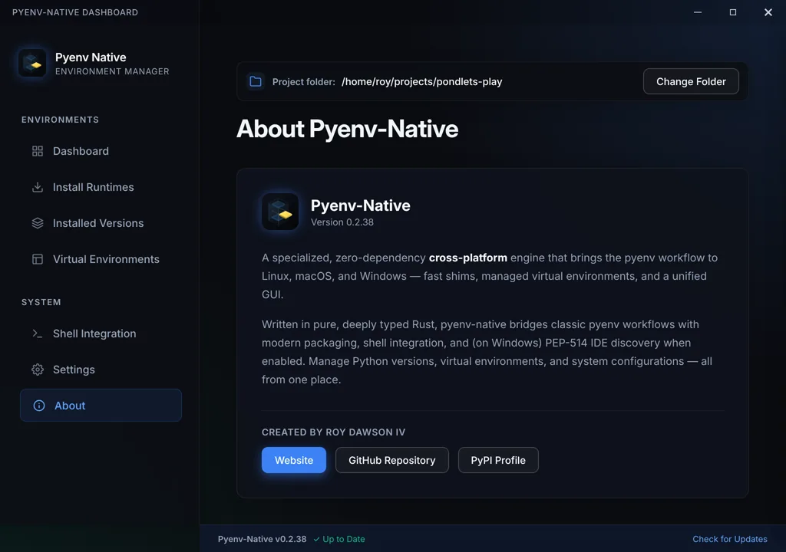

# Pyenv Native GUI Companion

The **Pyenv Native GUI** is a desktop dashboard built with Tauri v2 for managing Python environments visually.

> [!IMPORTANT]
> **Status:** Ships on **Windows x64**, **Linux x64**, and **macOS** (arm64/x64) native release bundles. Cross-compiled bundles (Windows ARM64, Linux ARM64, Android) do **not** include the GUI.

## Features

- **Dashboard**: Live view of your active Python version, managed venvs, and pyenv root, including a status light for pending pip updates. Doctor warnings appear as a click-through banner.
- **Project folder**: The folder bar stays visible on every page. **Make Local** writes `.python-version` there; **Pin to another folder…** in a card’s **More** menu opens a picker without changing the bar.
- **Pip Package Explorer**: Drawer focused on a target interpreter to browse installed dependencies, audit updates, statically pre-check requirements.txt constraints, and scan codebase imports.
- **Codebase Import Analyzer**: Statically parses Python source in the active workspace, flags missing third-party imports, and can install them progressively.
- **Pip Updates**: Audits packages against PyPI with a multiselect checklist. The gold update button stays dimmed until at least one package is selected. Outdated `pip` is updated first.
- **Conflict Pre-checker**: Resolves local files or HTTPS URLs (GitHub blob links translated to raw) before `pip install`.
- **Visual Management**: Browse and install CPython 2.x / 3.x and PyPy. Latest patch per line is the default; Python 2 stays in the catalog for legacy projects.
- **Venv Manager**: Create, list, delete, and migrate named virtual environments onto another installed runtime. Cards keep **Package Explorer** plus a **More** menu (global/local, migrate, delete). The GUI calls the same `venv upgrade` path as the CLI. Global badges and Make Global use the canonical `base/envs/name` spec (aliases such as `venv:name` still match). Rename, `venv use`, and shell-scoped `pyenv shell` remain CLI-only.
- **Diagnostics & Self-Healing**: Runs doctor/preflight checks and can apply automated repairs. Warnings use the same `WARN` status as the CLI. Dock, Start Menu, and `.desktop` launches do not inherit interactive shell PATH. At startup the GUI prepends `PYENV_ROOT/bin` and `shims` onto **its own process PATH** so doctor, pip, and runtime lookups work inside the app. Shell Integration cards still describe **terminal / launch PATH** (profile configured vs not, and whether shims were already on PATH when the GUI started). If prepend cannot put those dirs on process PATH and profiles already have `pyenv init`, doctor reports Info rather than Warn and Self-Healing will not try to “repair” desktop PATH. On Windows, a Microsoft Store / App Installer `python.exe` alias is **Warn** when it sits ahead of pyenv shims on the **terminal launch PATH**. **Self-Healing deletes those `python.exe` / `python3.exe` stubs** — that is the functional fix. Windows has no public API to flip the Settings toggles, so **Open App execution aliases** is optional insurance if you want App Installer `python.exe` / `python3.exe` shown Off (Windows 11: Settings > Apps > Advanced app settings > App execution aliases; Windows 10: Settings > Apps > App execution aliases).
- **Settings**: Interface language (`ui.language`, including Match system), architecture, pip bootstrap, and optional companion base-venv flags (`venv.auto_create_base_venv` and `venv.auto_use_base_venv` default **off**). On Windows, `windows.registry_mode=pep514` writes HKCU PEP-514 keys under `Software\Python\PyenvNative` (not `PythonCore`). The Windows settings block is hidden on Linux/macOS. Language can also be changed from the bottom of the sidebar.
- **Self-Update**: Check for and install `pyenv-native` updates from the UI.

## Visual Tour



<details>
<summary><b>View Screen Gallery</b></summary>
<br />

| Dashboard | Installed Versions | Virtual Envs |
| :---: | :---: | :---: |
|  |  |  |

| Install Runtimes | Shell Integration | Settings |
| :---: | :---: | :---: |
|  |  |  |



Regenerate from the repo root with `node ./scripts/gui-screenshots/capture.mjs` (Playwright + ffmpeg).

</details>

## Installation & Launch

Native release bundles for **Windows x64**, **Linux x64**, and **macOS** include `pyenv-gui` next to `pyenv`. After install:

```text
pyenv gui
```

Standalone GUI binaries (and matching `.sha256` files) are also attached to each GitHub Release. Verify the checksum before running a standalone download.

### Windows (dev)

```powershell
pwsh -NoLogo -NoProfile -File .\scripts\launch_gui.ps1
```

### Building from source (macOS/Linux)

```bash
cargo build --release -p pyenv-gui
```

Linux needs `webkit2gtk-4.1` and other Tauri system dependencies.

### Accessibility check

Static markup (jsdom + axe, contrast off):

```bash
pnpm --dir scripts/gui-a11y install --frozen-lockfile
pnpm --dir scripts/gui-a11y run check
```

Rendered GUI evidence gate (WCAGate, WCAG 2.2 AA, contrast on). This does **not** invent a WCAG percentage:

```bash
npm --prefix scripts/wcagate install
npm --prefix scripts/wcagate run wcagate:doctor
npm --prefix scripts/wcagate run wcagate:prepare
npm --prefix scripts/wcagate run wcagate:audit
```

---

The GUI is a companion to the CLI. Changes in the GUI are reflected in the terminal and vice versa.
